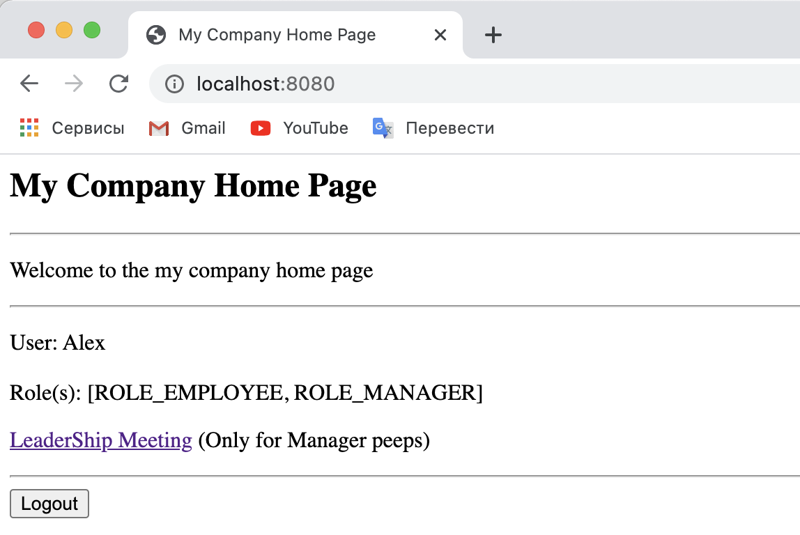

# I learned from this project how to ...

- Secure Spring MVC Web Apps;
- Develop login pages (default and custom);
- Define users and roles with simple authentication;
- Protect URLs based on role;
- Use JSP tags to hide/show content based on role;
- Store users,passwords and roles in DB (plain-text -> encrypted).

- Limited access depending on the role - ADMIN

- Limited access depending on the role - MANAGER

- Limited access depending on the role - EMPLOYEE

