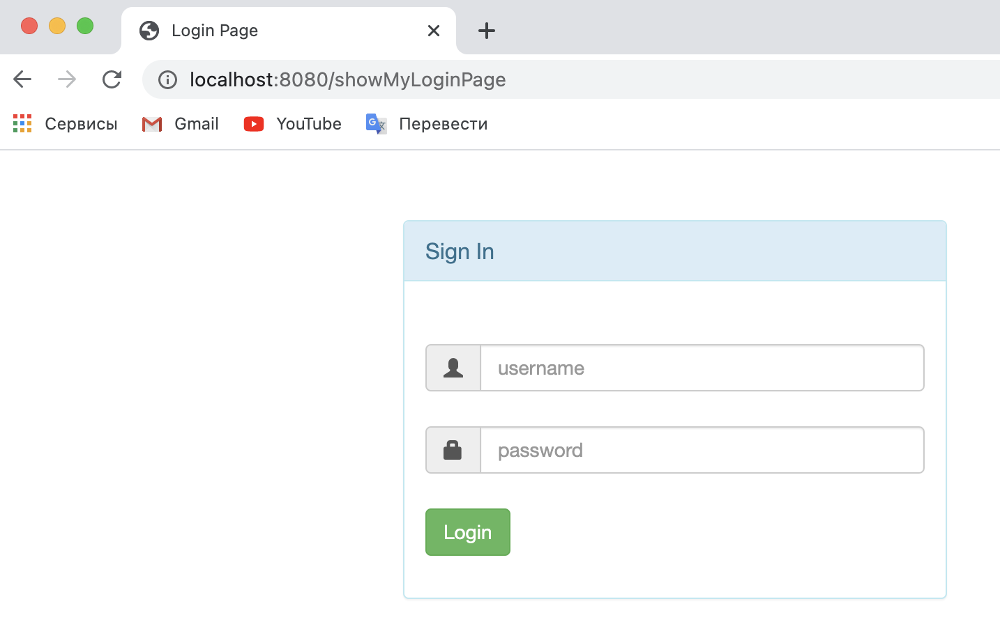
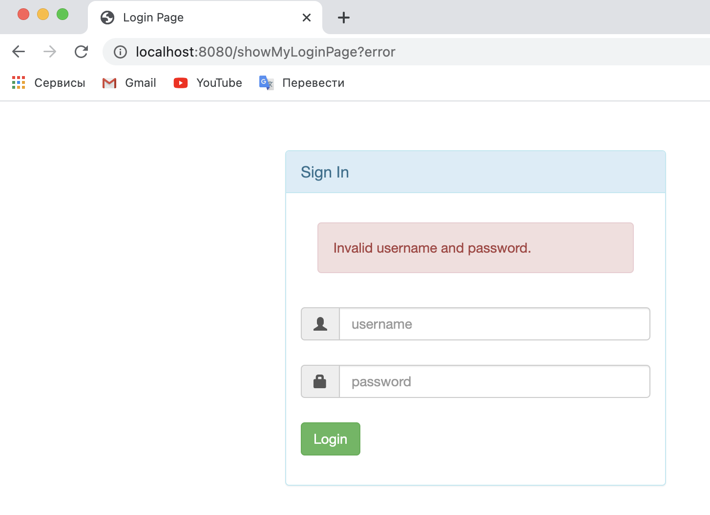
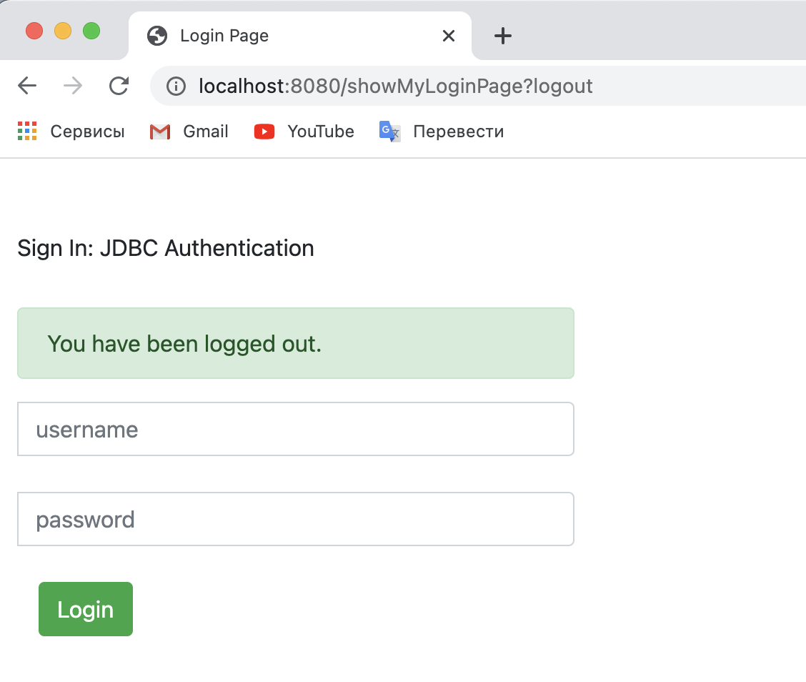
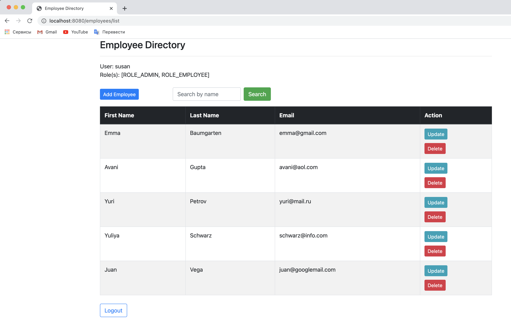
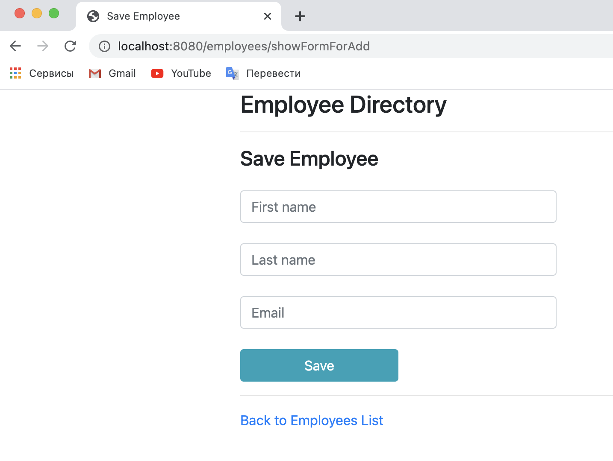
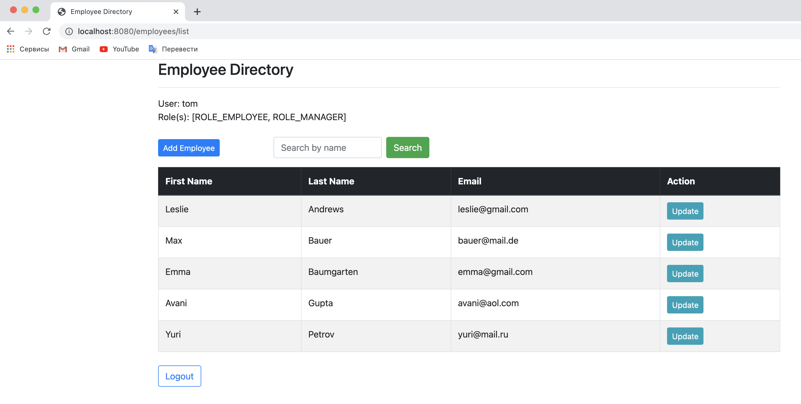
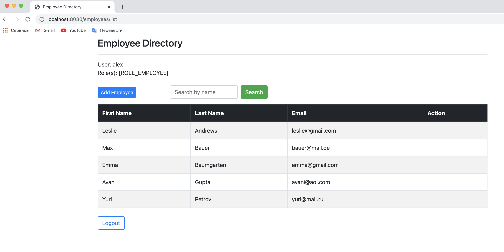
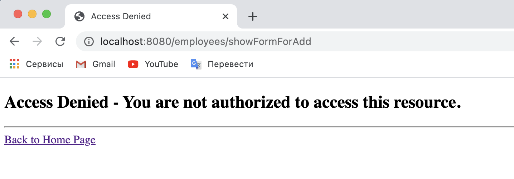

# I learned from this project ...

As part of the Udemy course - "Spring & Hibernate for Beginners (includes Spring Boot)" develop a fully working app with Spring Boot, Spring Data JPA, Spring Security (JDBC) and Thymeleaf with connection to the MySQL database.
******
Built Customer Relationship Management System, which allow track customers and with ability 
add new customers, update, delete and also list all the customers to the database and display content 
depending on the user's role and his access rights.

- Employee role: users in this role will only be allowed to list employees.
- Manager role: users in this role will be allowed to list, add and update employees.
- Admin role: users in this role will be allowed to list, add, update and delete employees. 
******
This app makes use of JDBC Authentication with encrypted passwords.
******
## Technologies used:
- Java 8, 11
- Spring Boot
- Spring Data JPA
- Spring Security (JDBC)
- Maven
- MySQL
- HTML5
- CSS
- Bootstrap
- Thymeleaf
- IntelliJ IDEA
- TomCat
*****

*****

*****

*****
## Admin role
*****

*****

*****
## Manager role
*****

*****
## Employee role
*****

*****
### When a user with the Employee role tries to add an employee without having rights to do so, we get the following message
*****

