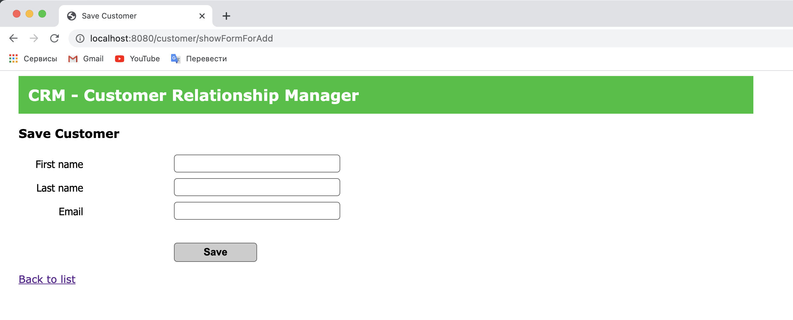

# I learned from this project how to ...

- build Customer Relationship Management System, 
  which allow track customers with ability add new customers, update, delete 
  and  also list all the customers to the database.

- integrate both of those technologies, Spring and Hibernate, 
  together and have a full working Spring MVC and Hibernate app 
  that talks to the My Sequel database.

